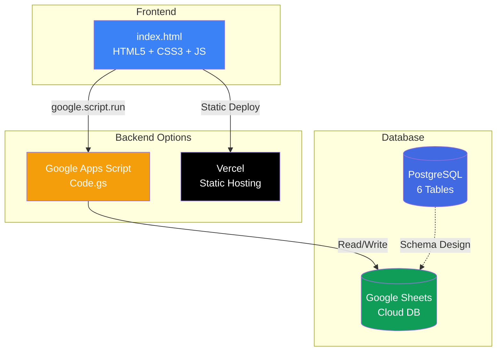

<div align="center">

# 🏢 NEXUS SPACE — Meeting Room & Co-working Booking System

### ระบบจองห้องประชุมและ Co-working Space

[](https://www.postgresql.org/)
[](https://developer.mozilla.org/en-US/docs/Web/JavaScript)
[](https://developer.mozilla.org/en-US/docs/Web/HTML)
[](https://developer.mozilla.org/en-US/docs/Web/CSS)
[](https://developers.google.com/apps-script)
[](https://vercel.com/)

<br>

**A full-stack meeting room booking system built with PostgreSQL, JavaScript, and modern web technologies.**

**ระบบจองห้องประชุมแบบครบวงจร พัฒนาด้วย PostgreSQL และเทคโนโลยีเว็บสมัยใหม่**

<br>

[🌐 Live Demo](https://nexus-space.vercel.app) · [📄 Documentation](#-documentation) · [🗂️ Database Schema](#-database-schema)

</div>

---

## 📋 Table of Contents | สารบัญ

- [✨ Features | ฟีเจอร์หลัก](#-features--ฟีเจอร์หลัก)
- [🖥️ Screenshots | ภาพหน้าจอ](#️-screenshots--ภาพหน้าจอ)
- [🗂️ Database Schema](#️-database-schema)
- [🏗️ Architecture | สถาปัตยกรรมระบบ](#️-architecture--สถาปัตยกรรมระบบ)
- [🚀 Getting Started | เริ่มต้นใช้งาน](#-getting-started--เริ่มต้นใช้งาน)
- [📁 Project Structure | โครงสร้างโปรเจค](#-project-structure--โครงสร้างโปรเจค)
- [📖 Documentation](#-documentation)
- [👨‍💻 Author | ผู้พัฒนา](#-author--ผู้พัฒนา)

---

## ✨ Features | ฟีเจอร์หลัก

<table>
<tr>
<td width="50%">

### 🇹🇭 ภาษาไทย

- 🏠 **แสดงรายการห้องประชุม** พร้อมสถานะว่าง/ไม่ว่าง (สีเขียว/แดง)
- 📅 **จองห้องออนไลน์** พร้อมเลือกอุปกรณ์เสริม
- 💰 **คำนวณราคาอัตโนมัติ** แบบ Real-time (ราคาห้อง × ชั่วโมง + ค่าอุปกรณ์)
- 🔒 **ป้องกันการจองซ้ำซ้อน** (Double Booking Prevention)
- 📊 **หน้า Admin Dashboard** ตรวจสอบรายการจองและอัปเดตสถานะชำระเงิน
- 🔍 **ค้นหาประวัติการจอง** ตามเบอร์โทรหรือรหัสสมาชิก
- 🌙 **Dark / Light Mode** สลับธีมได้
- 📱 **Responsive Design** รองรับทุกขนาดหน้าจอ

</td>
<td width="50%">

### 🇬🇧 English

- 🏠 **Room listing** with real-time availability (green/red status)
- 📅 **Online booking** with optional equipment add-ons
- 💰 **Auto price calculation** in real-time (room rate × hours + equipment fees)
- 🔒 **Double booking prevention** with time overlap validation
- 📊 **Admin Dashboard** for booking management and payment tracking
- 🔍 **Booking history search** by phone number or member ID
- 🌙 **Dark / Light Mode** toggle
- 📱 **Fully responsive** across all devices

</td>
</tr>
</table>

---

## 🖥️ Screenshots | ภาพหน้าจอ

<div align="center">

### 🏠 Room Listing | หน้ารายการห้อง
> แสดงรายการห้องทั้งหมด พร้อมสถานะ ว่าง (สีเขียว) / ไม่ว่าง (สีแดง)

<!-- Replace with actual screenshot -->
<!--  -->

### 📅 Booking Form | ฟอร์มจองห้อง
> เลือกห้อง วันที่ เวลา อุปกรณ์เสริม พร้อมคำนวณราคาอัตโนมัติ

### 📊 Admin Dashboard | หน้าผู้ดูแลระบบ
> ตรวจสอบรายการจองทั้งหมด อัปเดตสถานะ

### 🗃️ ER Diagram | แผนภาพความสัมพันธ์
> ออกแบบตามแนวคิด MS Access Relationship View

</div>

---

## 🗂️ Database Schema

ระบบฐานข้อมูลประกอบด้วย **6 ตาราง** ออกแบบตามหลัก **Normalization** บน **PostgreSQL**:

```
┌──────────────┐     ┌──────────────────┐     ┌──────────────┐
│   MEMBER     │     │     BOOKING      │     │     ROOM     │
├──────────────┤     ├──────────────────┤     ├──────────────┤
│🔑 MEMBER_CODE│────▶│🔑 BOOKING_CODE   │◀────│🔑 ROOM_CODE  │
│  FNAME       │ 1:M │🔗 MEMBER_CODE(FK)│ M:1 │  ROOM_NAME   │
│  LNAME       │     │🔗 ROOM_CODE  (FK)│     │  ROOM_TYPE   │
│  PHONE       │     │  BOOKING_DATE    │     │  CAPACITY    │
│  EMAIL       │     │  START_TIME      │     │  PRICE/HOUR  │
│  MEMBER_TYPE │     │  END_TIME        │     │  STATUS      │
│  REGISTER_DT │     │  STATUS          │     │  FLOOR       │
└──────────────┘     │  TOTAL_PRICE     │     └──────────────┘
                     └────────┬─────────┘
                              │
                    ┌─────────┴─────────┐
                    │                   │
           ┌────────▼────────┐  ┌───────▼───────┐
           │BOOKING_EQUIPMENT│  │    PAYMENT    │
           ├─────────────────┤  ├───────────────┤
           │🔑🔗BOOKING_CODE │  │🔑 PAYMENT_CODE│
           │🔑🔗EQUIPMENT_CD │  │🔗 BOOKING_CODE│
           │  QTY_USED       │  │  PAYMENT_DATE │
           └────────┬────────┘  │  AMOUNT       │
                    │           │  METHOD       │
           ┌────────▼────────┐  │  STATUS       │
           │   EQUIPMENT     │  └───────────────┘
           ├─────────────────┤
           │🔑 EQUIPMENT_CODE│
           │  EQUIPMENT_NAME │
           │  QTY            │
           │  STATUS         │
           │  PRICE          │
           └─────────────────┘
```

### Key Design Decisions | จุดเด่นของการออกแบบ

| Concept | Description (EN) | คำอธิบาย (TH) |
|---|---|---|
| **Composite PK** | `BOOKING_EQUIPMENT` uses composite primary key (`BOOKING_CODE` + `EQUIPMENT_CODE`) | ใช้ Primary Key คู่ป้องกันข้อมูลซ้ำซ้อน |
| **Junction Table** | Resolves Many-to-Many between BOOKING ↔ EQUIPMENT | ตารางเชื่อมแก้ปัญหาความสัมพันธ์ M:M |
| **TOTAL_PRICE** | Stored in BOOKING to preserve historical pricing (price-at-time-of-booking) | เก็บราคาจริง ณ วันจอง ไม่เปลี่ยนตามราคาปัจจุบัน |
| **Time Overlap** | SQL constraint `CHECK (END_TIME > START_TIME)` + application-level overlap validation | ป้องกันจองเวลาซ้ำซ้อนทั้ง DB Level และ App Level |

---

## 🏗️ Architecture | สถาปัตยกรรมระบบ



### Tech Stack

| Layer | Technology | Purpose |
|---|---|---|
| **Frontend** | HTML5, CSS3, JavaScript | User Interface & UX |
| **Backend** | Google Apps Script | Server-side logic & API |
| **Database** | PostgreSQL | Relational database schema |
| **Cloud DB** | Google Sheets | Runtime data storage |
| **Hosting** | Vercel | Static site deployment |
| **Design** | Glassmorphism, CSS Variables | Modern UI/UX |

---

## 🚀 Getting Started | เริ่มต้นใช้งาน

### Option 1: Open Locally | เปิดในเครื่อง (ง่ายสุด)

```bash
# Clone the repository
git clone https://github.com/YOUR_USERNAME/nexus-space.git

# Open in browser (no server needed!)
# เปิดในเบราว์เซอร์ (ไม่ต้องลง server!)
open index.html
```

> 💡 **ไฟล์ `index.html` มี Mock Data ในตัว** เปิดดับเบิ้ลคลิกได้เลยโดยไม่ต้องลง dependencies ใดๆ

### Option 2: Deploy on Vercel | Deploy ขึ้น Vercel

```bash
# Install Vercel CLI
npm i -g vercel

# Deploy
vercel --prod
```

### Option 3: Google Apps Script (Full Backend)

1. สร้าง Google Spreadsheet ใหม่
2. ไปที่ **Extensions > Apps Script**
3. วางโค้ด `Code.gs` → Run ฟังก์ชัน `initDatabase()`
4. สร้างไฟล์ `index.html` ใน Apps Script Editor
5. Deploy as **Web App** → เปิดลิงก์ใช้งานได้ทันที

### PostgreSQL Setup (Schema Only)

```bash
# Import schema to PostgreSQL via DBeaver or psql
psql -U postgres -d your_database -f database_schema.sql
```

---

## 📁 Project Structure | โครงสร้างโปรเจค

```
nexus-space/
├── 📄 index.html                    # Main web application (Frontend)
├── 📄 Code.gs                       # Google Apps Script backend
├── 📄 database_schema.sql           # PostgreSQL DDL + Seed Data
├── 📄 er_diagram_access_style.html  # ER Diagram (MS Access style)
├── 📄 er_diagram.svg                # ER Diagram vector graphic
├── 📄 vercel.json                   # Vercel deployment config
├── 📄 package.json                  # Project metadata
├── 📄 LICENSE                       # MIT License
└── 📄 README.md                     # This file
```

---

## 📖 Documentation

### Database Tables Summary

| # | Table | Records | Description |
|---|---|---|---|
| 1 | `MEMBER` | 4 | ข้อมูลสมาชิกผู้ใช้งาน (Members) |
| 2 | `ROOM` | 5 | ห้องประชุมและพื้นที่ทำงาน (Rooms) |
| 3 | `EQUIPMENT` | 4 | อุปกรณ์เสริมให้บริการ (Equipment) |
| 4 | `BOOKING` | 3 | การจองห้องประชุม (Bookings) |
| 5 | `BOOKING_EQUIPMENT` | 5 | ตารางเชื่อม M:M (Junction Table) |
| 6 | `PAYMENT` | 3 | การชำระเงิน (Payments) |

### Room Types | ประเภทห้อง

| Type | Capacity | Price/Hour | Description |
|---|---|---|---|
| 🎨 Creative Pod | 2 persons | ฿120 | ห้องทำงานส่วนตัวขนาดเล็ก |
| 🧠 Meeting Room | 6 persons | ฿250 | ห้องประชุมทีมงาน |
| 👔 Boardroom | 14 persons | ฿500 | ห้องประชุมผู้บริหาร |
| 🎪 Event Hall | 40 persons | ฿1,200 | ห้องจัดอีเวนท์ขนาดใหญ่ |

### Equipment | อุปกรณ์เสริม

| Equipment | Price/Use | Stock |
|---|---|---|
| 📽️ 4K Laser Projector | ฿150 | 5 units |
| 📋 Smart Interactive Whiteboard | ฿100 | 3 units |
| 🎤 Wireless Microphone System | ฿120 | 4 units |
| 📸 360° Hybrid Meeting Camera | ฿80 | 3 units |

---

## 🎓 Academic Information | ข้อมูลรายวิชา

| | Details |
|---|---|
| **Course** | CSC362-64 sec02 Database Systems |
| **Instructor** | อ.สุมนา เกษมสวัสดิ์ (Aj. Sumana Kasemsawat) |
| **Semester** | ภาคการศึกษาที่ 1/2569 |
| **DBMS** | PostgreSQL (Relational Database Management System) |

---

## 👨‍💻 Author | ผู้พัฒนา

<div align="center">

**นายณพัชรกัณฑ์ พัชญ์ชัยพงศา**

**Naphatcharakan Patchaipongsa**

Student ID: 6800401

[](https://github.com/Novterss)

</div>

---

## 📄 License

This project is licensed under the MIT License — see the [LICENSE](LICENSE) file for details.

---

<div align="center">

**Built with ❤️ for CSC362 Database Systems**

*Rangsit University — Faculty of Information Technology*

</div>
